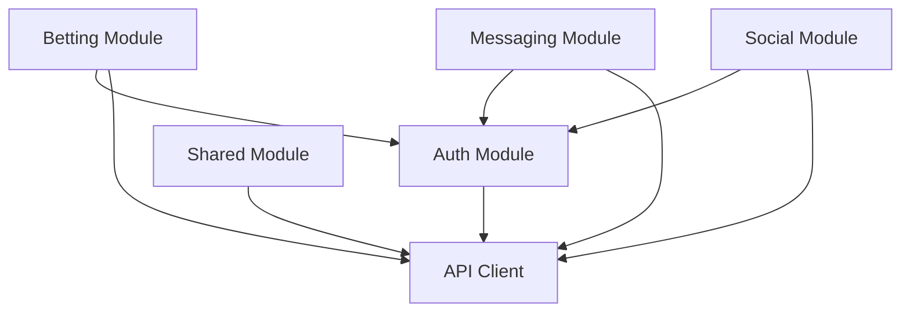

# Sprint 07.03: Module Migration Phase 1 - Core Features

## Sprint Goal
Migrate core feature modules (Auth, Betting, Messaging) to the new architecture while maintaining feature parity and adding comprehensive tests.

## Tasks

### 1. Auth Module Migration
- [ ] Create auth module structure
- [ ] Migrate authentication components
- [ ] Implement auth store with Zustand
- [ ] Create auth service layer
- [ ] Add auth guards and middleware
- [ ] Write comprehensive tests

**Module Structure:**
```typescript
// modules/auth/
├── components/
│   ├── LoginForm/
│   ├── SignupForm/
│   ├── ForgotPassword/
│   └── AuthGuard/
├── screens/
│   ├── WelcomeScreen.tsx
│   ├── LoginScreen.tsx
│   └── OnboardingScreen.tsx
├── hooks/
│   ├── useAuth.ts
│   ├── useAuthRedirect.ts
│   └── useSession.ts
├── services/
│   ├── authService.ts
│   ├── tokenService.ts
│   └── sessionService.ts
├── store/
│   └── authStore.ts
├── types/
│   └── auth.types.ts
├── utils/
│   └── authValidation.ts
├── __tests__/
└── index.ts
```

**Auth Store Implementation:**
```typescript
// modules/auth/store/authStore.ts
interface AuthState {
  user: User | null;
  session: Session | null;
  isAuthenticated: boolean;
  isLoading: boolean;
}

export const useAuthStore = create<AuthState & AuthActions>()(
  devtools(
    persist(
      (set, get) => ({
        // State
        user: null,
        session: null,
        isAuthenticated: false,
        isLoading: false,

        // Actions
        login: async (credentials) => {
          set({ isLoading: true });
          try {
            const { user, session } = await authService.login(credentials);
            set({ user, session, isAuthenticated: true });
          } finally {
            set({ isLoading: false });
          }
        },

        logout: async () => {
          await authService.logout();
          set({ user: null, session: null, isAuthenticated: false });
        }
      })
    )
  )
);
```

### 2. Betting Module Migration
- [ ] Create betting module structure
- [ ] Migrate all betting components
- [ ] Implement betting store
- [ ] Create betting services
- [ ] Add bet validation logic
- [ ] Write unit and integration tests

**Betting Components Migration:**
```typescript
// modules/betting/components/
├── BetSlip/
│   ├── BetSlip.tsx
│   ├── BetSlipItem.tsx
│   └── BetSlipSummary.tsx
├── GameCard/
│   ├── GameCard.tsx
│   ├── GameOdds.tsx
│   └── GameStatus.tsx
├── BetHistory/
│   ├── BetHistory.tsx
│   ├── BetHistoryItem.tsx
│   └── BetHistoryFilters.tsx
└── LiveBetting/
    ├── LiveGameTracker.tsx
    └── LiveOddsUpdate.tsx
```

**Betting Service Layer:**
```typescript
// modules/betting/services/bettingService.ts
export class BettingService {
  constructor(
    private api: ApiClient,
    private repository: IBetRepository
  ) {}

  async placeBet(input: PlaceBetInput): Promise<Bet> {
    // Validate bet
    const validation = await this.validateBet(input);
    if (!validation.isValid) {
      throw new ValidationError(validation.errors);
    }

    // Check user balance
    const balance = await this.checkBalance(input.userId);
    if (balance < input.amount) {
      throw new InsufficientFundsError();
    }

    // Place bet
    const bet = await this.repository.create(input);
    
    // Emit events
    eventBus.emit('bet.placed', bet);
    
    return bet;
  }

  private async validateBet(input: PlaceBetInput): Promise<ValidationResult> {
    // Business logic validation
  }
}
```

### 3. Messaging Module Migration
- [ ] Create messaging module structure
- [ ] Migrate chat components
- [ ] Implement messaging store
- [ ] Create real-time services
- [ ] Add message encryption
- [ ] Write comprehensive tests

**Real-time Messaging Implementation:**
```typescript
// modules/messaging/services/realtimeService.ts
export class RealtimeMessagingService {
  private subscriptions = new Map<string, RealtimeChannel>();

  async subscribeToChat(chatId: string, callbacks: MessageCallbacks) {
    const channel = this.supabase
      .channel(`chat:${chatId}`)
      .on('postgres_changes', {
        event: 'INSERT',
        schema: 'public',
        table: 'messages',
        filter: `chat_id=eq.${chatId}`
      }, callbacks.onNewMessage)
      .on('presence', { event: 'sync' }, callbacks.onPresenceSync)
      .subscribe();

    this.subscriptions.set(chatId, channel);
  }

  async sendMessage(message: SendMessageInput): Promise<Message> {
    // Encrypt message if needed
    const encrypted = await this.encryptMessage(message);
    
    // Send via API
    const sent = await this.api.post('/messages', encrypted);
    
    return sent;
  }
}
```

### 4. Social Module Foundation
- [ ] Create social module structure
- [ ] Migrate friend system components
- [ ] Implement social store
- [ ] Create engagement services
- [ ] Add activity feed logic
- [ ] Setup social analytics

**Social Features Structure:**
```typescript
// modules/social/
├── components/
│   ├── FriendsList/
│   ├── ActivityFeed/
│   ├── UserProfile/
│   └── Leaderboard/
├── services/
│   ├── friendService.ts
│   ├── activityService.ts
│   └── engagementService.ts
├── store/
│   └── socialStore.ts
└── hooks/
    ├── useFriends.ts
    ├── useActivity.ts
    └── useLeaderboard.ts
```

### 5. Module Integration Tests
- [ ] Create integration test suite
- [ ] Test module interactions
- [ ] Test data flow between modules
- [ ] Test error propagation
- [ ] Test offline scenarios
- [ ] Performance benchmarks

**Integration Test Example:**
```typescript
// __tests__/integration/betting-auth.test.ts
describe('Betting-Auth Integration', () => {
  it('should require authentication for placing bets', async () => {
    const { betting, auth } = setupTestModules();
    
    // Attempt bet without auth
    await expect(betting.placeBet(mockBet)).rejects.toThrow(
      AuthenticationError
    );
    
    // Login and retry
    await auth.login(mockCredentials);
    const bet = await betting.placeBet(mockBet);
    
    expect(bet).toBeDefined();
    expect(bet.userId).toBe(auth.currentUser.id);
  });
});
```

### 6. Data Migration Scripts
- [ ] Create data transformation utilities
- [ ] Write migration scripts for each module
- [ ] Test migrations with sample data
- [ ] Create rollback procedures
- [ ] Document migration process
- [ ] Verify data integrity

## Definition of Done
- [ ] All core modules migrated
- [ ] Feature parity maintained
- [ ] Tests passing with >85% coverage
- [ ] No regression in functionality
- [ ] Performance benchmarks met
- [ ] Documentation updated

## Module Dependencies


## Risk Mitigation
- Feature flags for gradual rollout
- Parallel run of old and new code
- Comprehensive test coverage
- Automated regression testing
- Performance monitoring

## Success Criteria
- Zero functional regressions
- 85%+ test coverage per module
- Performance within 5% of baseline
- Clean module boundaries
- No circular dependencies