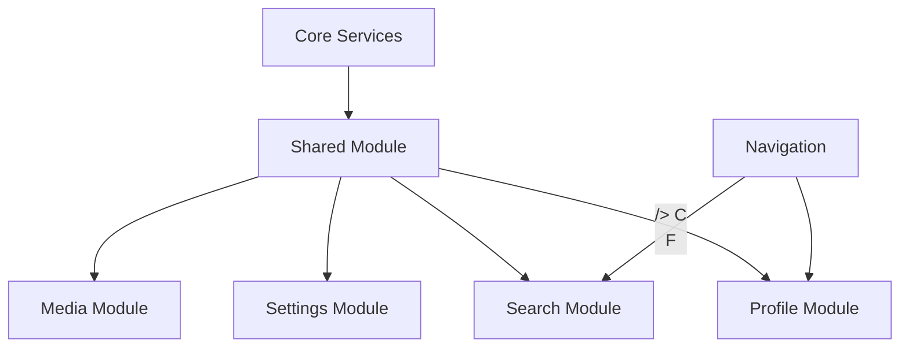

# Sprint 07.04: Module Migration Phase 2 - Supporting Features

## Sprint Goal
Complete migration of supporting feature modules (Profile, Settings, Search, Media) and establish the shared module with common utilities and components.

## Tasks

### 1. Profile Module Migration
- [ ] Create profile module structure
- [ ] Migrate profile components
- [ ] Implement profile store
- [ ] Create profile services
- [ ] Add avatar management
- [ ] Write comprehensive tests

**Profile Module Structure:**
```typescript
// modules/profile/
├── components/
│   ├── ProfileHeader/
│   ├── ProfileStats/
│   ├── ProfileEdit/
│   ├── AvatarUpload/
│   └── ProfileBadges/
├── screens/
│   ├── ProfileScreen.tsx
│   ├── EditProfileScreen.tsx
│   └── PublicProfileScreen.tsx
├── services/
│   ├── profileService.ts
│   ├── avatarService.ts
│   └── statsService.ts
├── store/
│   └── profileStore.ts
└── hooks/
    ├── useProfile.ts
    ├── useProfileStats.ts
    └── useAvatarUpload.ts
```

**Avatar Service Implementation:**
```typescript
// modules/profile/services/avatarService.ts
export class AvatarService {
  constructor(
    private storage: StorageService,
    private imageProcessor: ImageProcessor
  ) {}

  async uploadAvatar(userId: string, image: ImageAsset): Promise<string> {
    // Validate image
    this.validateImage(image);
    
    // Process image (resize, compress)
    const processed = await this.imageProcessor.process(image, {
      width: 400,
      height: 400,
      quality: 0.8
    });
    
    // Upload to storage
    const path = `avatars/${userId}/${Date.now()}.jpg`;
    const url = await this.storage.upload(path, processed);
    
    // Update profile
    await this.updateProfileAvatar(userId, url);
    
    return url;
  }
}
```

### 2. Settings Module Migration
- [ ] Create settings module structure
- [ ] Migrate settings screens
- [ ] Implement settings store
- [ ] Create preference services
- [ ] Add settings synchronization
- [ ] Write unit tests

**Settings Store Implementation:**
```typescript
// modules/settings/store/settingsStore.ts
interface SettingsState {
  preferences: UserPreferences;
  notifications: NotificationSettings;
  privacy: PrivacySettings;
  isDirty: boolean;
}

export const useSettingsStore = create<SettingsState & SettingsActions>()(
  persist(
    (set, get) => ({
      // State
      preferences: defaultPreferences,
      notifications: defaultNotifications,
      privacy: defaultPrivacy,
      isDirty: false,

      // Actions
      updatePreference: (key, value) => {
        set(state => ({
          preferences: { ...state.preferences, [key]: value },
          isDirty: true
        }));
      },

      saveSettings: async () => {
        const state = get();
        await settingsService.save({
          preferences: state.preferences,
          notifications: state.notifications,
          privacy: state.privacy
        });
        set({ isDirty: false });
      }
    }),
    {
      name: 'settings-store',
      version: 1,
      migrate: (persistedState, version) => {
        // Handle migrations
      }
    }
  )
);
```

### 3. Search Module Migration
- [ ] Create search module structure
- [ ] Migrate search components
- [ ] Implement search algorithms
- [ ] Create search indexing service
- [ ] Add search history/suggestions
- [ ] Optimize search performance

**Search Service Architecture:**
```typescript
// modules/search/services/searchService.ts
export class SearchService {
  private index: SearchIndex;
  private cache: SearchCache;

  async search(query: string, options: SearchOptions): Promise<SearchResults> {
    // Check cache
    const cached = await this.cache.get(query, options);
    if (cached) return cached;

    // Perform search
    const results = await this.performSearch(query, options);
    
    // Post-process results
    const processed = this.processResults(results, options);
    
    // Cache results
    await this.cache.set(query, options, processed);
    
    return processed;
  }

  private async performSearch(query: string, options: SearchOptions) {
    const searches = [];

    if (options.includeUsers) {
      searches.push(this.searchUsers(query));
    }
    if (options.includeGames) {
      searches.push(this.searchGames(query));
    }
    if (options.includeBets) {
      searches.push(this.searchBets(query));
    }

    const results = await Promise.all(searches);
    return this.mergeResults(results);
  }
}
```

### 4. Media Module Creation
- [ ] Create media module structure
- [ ] Implement image handling
- [ ] Add video processing
- [ ] Create media gallery components
- [ ] Implement media caching
- [ ] Add media optimization

**Media Processing Pipeline:**
```typescript
// modules/media/services/mediaProcessor.ts
export class MediaProcessor {
  async processImage(image: ImageAsset, options: ProcessingOptions) {
    const pipeline = new ProcessingPipeline();
    
    // Add processing steps
    pipeline.add(new ResizeStep(options.dimensions));
    pipeline.add(new CompressStep(options.quality));
    pipeline.add(new WatermarkStep(options.watermark));
    
    if (options.filters) {
      pipeline.add(new FilterStep(options.filters));
    }
    
    // Execute pipeline
    return pipeline.execute(image);
  }

  async generateThumbnail(video: VideoAsset): Promise<ImageAsset> {
    // Extract frame
    const frame = await this.extractFrame(video, { time: 0 });
    
    // Process as image
    return this.processImage(frame, {
      dimensions: { width: 320, height: 180 },
      quality: 0.7
    });
  }
}
```

### 5. Shared Module Implementation
- [ ] Create shared module structure
- [ ] Extract common components
- [ ] Implement shared hooks
- [ ] Create utility functions
- [ ] Add shared types
- [ ] Setup shared services

**Shared Components Library:**
```typescript
// modules/shared/components/
├── Button/
│   ├── Button.tsx
│   ├── Button.styles.ts
│   ├── Button.types.ts
│   └── Button.test.tsx
├── Card/
├── Modal/
├── Form/
│   ├── Input/
│   ├── Select/
│   ├── Checkbox/
│   └── FormField/
├── Feedback/
│   ├── Toast/
│   ├── Alert/
│   └── Loading/
└── Layout/
    ├── Container/
    ├── Grid/
    └── Spacer/
```

**Shared Hooks Collection:**
```typescript
// modules/shared/hooks/
├── useDebounce.ts
├── useThrottle.ts
├── useInfiniteScroll.ts
├── useLocalStorage.ts
├── useNetworkStatus.ts
├── usePermissions.ts
├── usePrevious.ts
└── useTimeout.ts

// Example implementation
export function useDebounce<T>(value: T, delay: number): T {
  const [debouncedValue, setDebouncedValue] = useState(value);

  useEffect(() => {
    const handler = setTimeout(() => {
      setDebouncedValue(value);
    }, delay);

    return () => clearTimeout(handler);
  }, [value, delay]);

  return debouncedValue;
}
```

### 6. Navigation Module Setup
- [ ] Create navigation configuration
- [ ] Implement navigation guards
- [ ] Add deep linking support
- [ ] Create navigation helpers
- [ ] Setup navigation analytics
- [ ] Add navigation state persistence

**Navigation Configuration:**
```typescript
// navigation/config/routes.ts
export const routes = {
  auth: {
    welcome: 'auth/welcome',
    login: 'auth/login',
    signup: 'auth/signup'
  },
  main: {
    feed: 'main/feed',
    games: 'main/games',
    messages: 'main/messages',
    profile: 'main/profile'
  },
  modal: {
    betSlip: 'modal/bet-slip',
    settings: 'modal/settings'
  }
} as const;

// navigation/guards/authGuard.ts
export function authGuard(navigation: Navigation) {
  return (route: Route) => {
    const isAuthenticated = useAuthStore.getState().isAuthenticated;
    
    if (!isAuthenticated && route.requiresAuth) {
      navigation.navigate(routes.auth.login);
      return false;
    }
    
    return true;
  };
}
```

## Definition of Done
- [ ] All supporting modules migrated
- [ ] Shared module fully implemented
- [ ] Navigation system updated
- [ ] Tests passing with >80% coverage
- [ ] Performance optimizations applied
- [ ] Documentation completed

## Module Integration Map


## Performance Targets
- Search response time < 200ms
- Image processing < 1s
- Settings sync < 500ms
- Profile load < 300ms
- Navigation transition < 100ms

## Testing Strategy
1. Unit tests for all services
2. Component tests with Testing Library
3. Integration tests for module interactions
4. Performance tests for critical paths
5. Accessibility tests for UI components

## Success Criteria
- All modules successfully migrated
- No increase in bundle size > 10%
- Performance targets achieved
- Zero accessibility violations
- Clean code metrics maintained